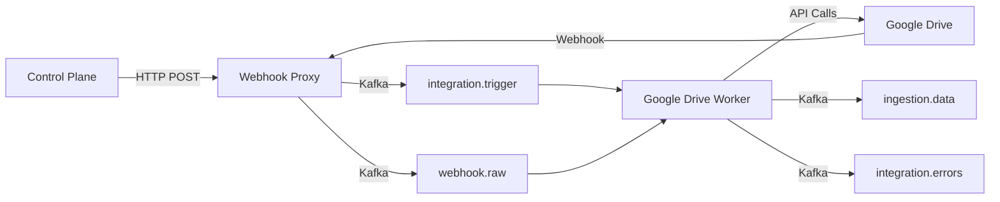

# Google Drive Integration Worker

## Overview

The Google Drive Integration Worker is a Kafka-native service that ingests file metadata, revisions, permissions, and change events from Google Drive into the Clustera Data Plane. It's part of the Clustera Integrations platform and follows the established patterns from the integration architecture.

## Architecture

### Key Components

1. **Trigger Handler**: Processes polling triggers from `integration.trigger` topic
   - Full sync: Enumerate all files/folders in scope
   - Incremental sync: Use Changes API to fetch only updates

2. **Webhook Handler**: Processes push notifications from `webhook.raw` topic
   - Real-time change notifications from Google Drive
   - Fetches actual changes via Changes API

3. **API Client**: Interacts with Google Drive API v3
   - OAuth 2.0 authentication with token refresh
   - Rate limiting and exponential backoff
   - Support for batch requests

4. **Data Normalizer**: Transforms Google Drive data to standard format
   - Files, folders, revisions, permissions
   - Export Google Workspace files to standard formats

### Data Flow



## Setup

### Prerequisites

- Python 3.11+
- Kafka cluster
- Google Cloud Project with Drive API enabled
- OAuth 2.0 credentials

### Installation

```bash
# Clone repository
git clone https://github.com/clusterahq/clustera-integration-google-drive.git
cd clustera-integration-google-drive

# Initialize submodules
git submodule update --init --recursive

# Install dependencies (development)
pip install -e ".[dev]"
```

### Configuration

Environment variables:

```bash
# Kafka Configuration
export KAFKA_BOOTSTRAP_SERVERS=localhost:9092
export KAFKA_CONSUMER_GROUP_ID=google-drive-worker

# Worker Configuration
export WORKER_INTEGRATION_ID=google-drive
export WORKER_MAX_CONCURRENT_CONNECTIONS=10

# Google Drive API Configuration
export GDRIVE_API_BASE_URL=https://www.googleapis.com/drive/v3
export GDRIVE_PAGE_SIZE=100
export GDRIVE_INCLUDE_SHARED_DRIVES=true

# S3 Configuration (for large payloads)
export S3_BUCKET_NAME=clustera-integrations
export S3_REGION=us-east-1

# Control Plane Configuration
export CONTROL_PLANE_BASE_URL=https://control-plane.clustera.io
export CONTROL_PLANE_MTLS_CERT_PATH=/etc/certs/client.crt
export CONTROL_PLANE_MTLS_KEY_PATH=/etc/certs/client.key

# Logging
export LOG_LEVEL=INFO
export LOG_FORMAT=json
```

## Running

### Local Development

```bash
# Run worker
python -m google_drive_worker

# Or with custom config
LOG_LEVEL=DEBUG python -m google_drive_worker
```

### Docker

```bash
# Build image
docker build -t google-drive-worker:latest .

# Run container
docker run \
  -e KAFKA_BOOTSTRAP_SERVERS=kafka:9092 \
  -e CONTROL_PLANE_BASE_URL=https://control-plane.clustera.io \
  google-drive-worker:latest
```

### Kubernetes

```bash
# Apply deployment
kubectl apply -f deploy/kubernetes/

# Check status
kubectl get pods -l app=google-drive-worker
```

## Development

### Project Structure

```
src/google_drive_worker/
├── __init__.py
├── __main__.py           # Entry point
├── config.py             # Configuration management
├── worker.py             # Main orchestration
├── handlers/
│   ├── base.py          # Base handler interface
│   ├── trigger.py       # Trigger handler
│   └── webhook.py       # Webhook handler
├── client/
│   ├── drive_api.py     # Google Drive API client
│   └── auth.py          # OAuth handling
├── normalization/
│   └── transformer.py   # Data normalization
└── utils/
    └── errors.py        # Error classification
```

### Testing

```bash
# Run unit tests
pytest tests/unit/

# Run integration tests (requires test environment)
pytest tests/integration/

# Run with coverage
pytest --cov=google_drive_worker --cov-report=html
```

### Code Quality

```bash
# Format code
black src/ tests/

# Lint
ruff src/ tests/

# Type check
mypy src/
```

## API Integration

### Supported Google Drive Features

- **Files & Folders**: Full metadata including size, MIME type, timestamps
- **Revisions**: Version history for files
- **Permissions**: Sharing settings and access control
- **Comments**: Inline comments and suggestions
- **Shared Drives**: Team drives with delegated ownership
- **Changes API**: Incremental sync with page tokens
- **Push Notifications**: Real-time webhook support

### Rate Limits

Google Drive API quotas:
- 10,000 queries per 100 seconds per user
- Per-project quotas apply

The worker implements:
- Exponential backoff on 429 responses
- Quota tracking via `quotaUser` parameter
- Batch requests for efficiency (up to 100 operations)

## Message Schemas

### Trigger Message (input)

```json
{
  "message_id": "uuid-v4",
  "customer_id": "cust_123",
  "integration_id": "google-drive",
  "integration_connection_id": "conn_abc",
  "trigger_type": "full_sync" | "incremental" | "poll",
  "last_cursor": {
    "page_token": "...",
    "timestamp": "2025-01-20T10:00:00Z"
  }
}
```

### Ingestion Data (output)

```json
{
  "message_id": "uuid-v4",
  "customer_id": "cust_123",
  "integration_id": "google-drive",
  "integration_connection_id": "conn_abc",
  "resource_type": "file",
  "resource_id": "file_123",
  "idempotency_key": "google-drive:conn_abc:file:file_123",
  "data": {
    "id": "file_123",
    "type": "file",
    "name": "Document.docx",
    "mime_type": "application/vnd.google-apps.document",
    "size_bytes": 12345,
    "created_at": "2025-01-15T10:00:00Z",
    "modified_at": "2025-01-20T15:30:00Z"
  }
}
```

## Monitoring

### Metrics

The worker exports the following metrics:
- `messages_processed`: Total messages processed
- `messages_failed`: Failed message count
- `records_produced`: Records sent to ingestion.data
- `errors_produced`: Errors sent to integration.errors

### Health Checks

- Liveness: `/health/live` (HTTP endpoint when enabled)
- Readiness: Kafka connection status

### Logging

Structured JSON logs include:
- Message processing events
- API call details (without secrets)
- Error classification
- Performance metrics

## Troubleshooting

### Common Issues

1. **OAuth Token Expired**
   - Worker automatically refreshes tokens
   - Check Control Plane for credential updates

2. **Rate Limiting**
   - Check logs for 429 responses
   - Adjust `WORKER_MAX_CONCURRENT_CONNECTIONS`
   - Implement quota tracking

3. **Large Files**
   - Files >256KB automatically offloaded to S3
   - Ensure S3 credentials are configured

4. **Webhook Delivery**
   - Verify domain ownership in Google Cloud Console
   - Check webhook proxy logs for validation errors

## Security

- OAuth 2.0 for API authentication
- mTLS for Control Plane communication
- No secrets in logs or traces
- Credentials fetched via STS tokens

## License

Proprietary - Clustera Inc.

## Support

- Documentation: See `docs/` directory
- Slack: #integrations-platform
- Email: platform@clustera.io