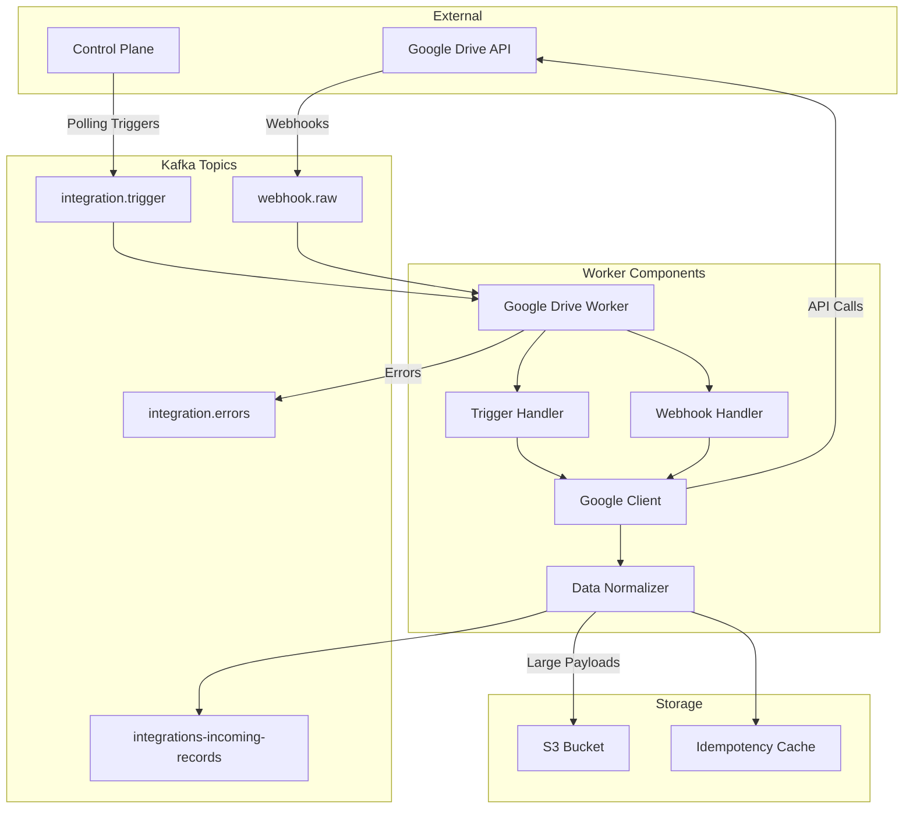

# Google Drive Integration Worker

[](https://github.com/clusterahq/clustera-integration-google-drive/actions)
[](https://codecov.io/gh/clusterahq/clustera-integration-google-drive)
[](https://www.python.org/downloads/)
[](LICENSE)
[](https://hub.docker.com/r/clusterahq/google-drive-worker)
[](deploy/kubernetes/)

## Overview

The Google Drive Integration Worker is a high-performance, Kafka-native service that continuously syncs file metadata, permissions, revisions, and change events from Google Drive into the Clustera AI platform. Built for scale and reliability, it processes millions of files with at-least-once delivery guarantees.

### Key Features

- 🔄 **Real-time Sync**: Webhook support for instant change notifications
- 📊 **Comprehensive Data**: Files, folders, permissions, revisions, and sharing metadata
- 🚀 **High Performance**: Concurrent processing with intelligent rate limiting
- 🔐 **Enterprise Security**: OAuth 2.0, M2M token authentication, and secure credential management
- 📈 **Production Ready**: Horizontal scaling, health checks, and Prometheus metrics
- 🎯 **Idempotent**: Deterministic key generation prevents duplicate processing

## Quick Start

### Using Docker Compose (Development)

```bash
# Clone with submodules
git clone --recursive https://github.com/clusterahq/clustera-integration-google-drive.git
cd clustera-integration-google-drive

# Start all services
docker-compose -f deploy/docker-compose.yml up -d

# View logs
docker-compose logs -f google-drive-worker

# Send test trigger
docker-compose exec kafka kafka-console-producer \
  --bootstrap-server kafka:29092 \
  --topic integration.trigger < examples/trigger-message.json
```

### Using Kubernetes (Production)

```bash
# Create namespace
kubectl create namespace integrations

# Apply configurations
kubectl apply -f deploy/kubernetes/

# Check deployment
kubectl get pods -n integrations -l app=google-drive-worker

# View logs
kubectl logs -n integrations -l app=google-drive-worker -f
```

## Architecture

### System Components



### Data Flow Example

```python
# 1. Control Plane sends trigger
trigger = {
    "integration_connection_id": "conn_abc123",
    "trigger_type": "incremental",
    "connection_config": {
        "refresh_token": "encrypted_token",
        "page_size": 100
    }
}

# 2. Worker processes trigger
async def process_trigger(trigger):
    # Authenticate with Google
    client = await authenticate(trigger.connection_config)

    # Fetch changes since last sync
    changes = await client.list_changes(page_token=trigger.last_cursor)

    # Process each change
    for change in changes:
        file_data = await client.get_file(change.file_id)
        normalized = normalize_file(file_data)

        # Produce to integrations-incoming-records
        await producer.send("integrations-incoming-records", normalized)

# 3. Normalized output
output = {
    "integration_connection_id": "conn_abc123",
    "resource_type": "file",
    "idempotency_key": "google-drive:conn_abc123:file:file_xyz",
    "data": {
        "id": "file_xyz",
        "name": "Q4 Report.pdf",
        "mime_type": "application/pdf",
        "size_bytes": 2048576,
        "permissions": [...],
        "created_at": "2025-01-01T10:00:00Z"
    }
}
```

## Configuration

### Environment Variables

| Variable | Description | Default | Required |
|----------|-------------|---------|----------|
| **Kafka Configuration** |
| `KAFKA_BOOTSTRAP_SERVERS` | Kafka broker addresses | - | ✅ |
| `KAFKA_CONSUMER_GROUP_ID` | Consumer group identifier | `google-drive-worker` | ❌ |
| `KAFKA_AUTO_OFFSET_RESET` | Where to start reading | `latest` | ❌ |
| **Worker Configuration** |
| `WORKER_INTEGRATION_ID` | Integration identifier | `google-drive` | ✅ |
| `WORKER_MAX_CONCURRENT_CONNECTIONS` | Max parallel connections | `10` | ❌ |
| `WORKER_S3_PAYLOAD_THRESHOLD_BYTES` | S3 offload threshold | `262144` | ❌ |
| **Google Drive API** |
| `GDRIVE_API_BASE_URL` | API base URL | `https://www.googleapis.com/drive/v3` | ❌ |
| `GDRIVE_PAGE_SIZE` | Results per page | `100` | ❌ |
| `GDRIVE_INCLUDE_SHARED_DRIVES` | Include team drives | `true` | ❌ |
| **S3 Configuration** |
| `S3_BUCKET_NAME` | Bucket for large payloads | - | ✅ |
| `S3_REGION` | AWS region | `us-west-2` | ❌ |
| `AWS_ACCESS_KEY_ID` | AWS credentials | - | ✅ |
| `AWS_SECRET_ACCESS_KEY` | AWS credentials | - | ✅ |

### OAuth Setup

1. **Create Google Cloud Project**
```bash
gcloud projects create clustera-integrations
gcloud config set project clustera-integrations
```

2. **Enable APIs**
```bash
gcloud services enable drive.googleapis.com
```

3. **Configure OAuth Consent**
   - Navigate to [Google Cloud Console](https://console.cloud.google.com)
   - APIs & Services → OAuth consent screen
   - Configure app details and scopes

4. **Create Credentials**
   - APIs & Services → Credentials → Create Credentials → OAuth client ID
   - Application type: Web application
   - Add redirect URIs

See [docs/OAUTH_SETUP.md](docs/OAUTH_SETUP.md) for detailed instructions.

## Development

### Prerequisites

- Python 3.11+
- Poetry for dependency management
- Docker and Docker Compose
- Kafka (via Docker or local installation)

### Local Setup

```bash
# Install dependencies
poetry install --with dev

# Run tests
poetry run pytest

# Run with coverage
poetry run pytest --cov=google_drive_worker --cov-report=html

# Format code
poetry run ruff format src/ tests/

# Lint
poetry run ruff check src/ tests/

# Type checking
poetry run mypy src/
```

### Testing Strategy

#### Unit Tests (97+ tests)
```bash
# Run all unit tests
poetry run pytest tests/unit/

# Run specific test file
poetry run pytest tests/unit/test_worker.py -v

# Run with markers
poetry run pytest -m "not slow"
```

#### Integration Tests
```bash
# Requires Docker
poetry run pytest tests/integration/

# Run specific integration test
poetry run pytest tests/integration/test_kafka_flow.py::TestKafkaFlow::test_end_to_end_trigger_flow
```

#### Performance Testing
```python
@pytest.mark.performance
async def test_large_file_processing():
    """Test processing 10,000 files."""
    files = generate_test_files(10000)
    start = time.time()

    await worker.process_files(files)

    duration = time.time() - start
    assert duration < 60  # Should process within 1 minute
    assert worker.metrics.processed == 10000
```

## API Integration Details

### Supported Google Drive Resources

| Resource | Operations | Fields Retrieved |
|----------|------------|------------------|
| **Files** | List, Get, Watch | id, name, mimeType, size, parents, owners, permissions, createdTime, modifiedTime |
| **Folders** | List, Get | id, name, mimeType, parents, permissions |
| **Permissions** | List | id, type, role, emailAddress, domain, displayName |
| **Revisions** | List | id, modifiedTime, size, lastModifyingUser |
| **Changes** | List | changeType, time, removed, fileId, file |
| **Comments** | List | id, content, author, createdTime, resolved |

### Rate Limiting Strategy

```python
class RateLimiter:
    """Adaptive rate limiter with exponential backoff."""

    def __init__(self, max_qps: int = 10):
        self.max_qps = max_qps
        self.window = deque(maxlen=100)

    async def acquire(self):
        """Wait if necessary to stay under rate limit."""
        now = time.time()

        # Remove old requests outside window
        while self.window and self.window[0] < now - 1:
            self.window.popleft()

        # Wait if at limit
        if len(self.window) >= self.max_qps:
            sleep_time = 1 - (now - self.window[0])
            await asyncio.sleep(max(0, sleep_time))

        self.window.append(time.time())
```

## Monitoring & Observability

### Prometheus Metrics

```yaml
# Example metrics exposed at :8080/metrics
google_drive_worker_messages_processed_total{type="trigger"} 12453
google_drive_worker_messages_processed_total{type="webhook"} 3421
google_drive_worker_files_synced_total 45678
google_drive_worker_api_calls_total{endpoint="files.list"} 234
google_drive_worker_api_errors_total{code="429"} 12
google_drive_worker_processing_duration_seconds{quantile="0.99"} 2.5
```

### Health Checks

```bash
# Liveness probe
curl http://localhost:8080/health/live

# Readiness probe
curl http://localhost:8080/health/ready

# Detailed status
curl http://localhost:8080/health/status
```

### Structured Logging

```json
{
  "timestamp": "2025-01-25T10:30:45.123Z",
  "level": "INFO",
  "logger": "google_drive_worker.worker",
  "message": "Processing trigger message",
  "fields": {
    "message_id": "msg_123",
    "connection_id": "conn_abc",
    "trigger_type": "incremental",
    "trace_id": "trace_xyz"
  }
}
```

## Troubleshooting

### Common Issues

| Issue | Symptoms | Solution |
|-------|----------|----------|
| **OAuth Token Expired** | 401 Unauthorized errors | Worker auto-refreshes; check Control Plane credentials |
| **Rate Limiting** | 429 Too Many Requests | Reduce `MAX_CONCURRENT_CONNECTIONS`, implement backoff |
| **Consumer Lag** | High lag in Kafka | Scale workers, optimize processing, check for errors |
| **Memory Issues** | OOM kills | Increase memory limits, check for leaks |
| **S3 Upload Failures** | "Failed to upload payload" | Verify S3 credentials and bucket permissions |

See [docs/TROUBLESHOOTING.md](docs/TROUBLESHOOTING.md) for comprehensive debugging guide.

## Production Deployment

### Scaling Recommendations

```yaml
# Horizontal Pod Autoscaler
spec:
  minReplicas: 2
  maxReplicas: 10
  metrics:
  - type: Resource
    resource:
      name: cpu
      target:
        averageUtilization: 70
  - type: Pods
    pods:
      metric:
        name: kafka_consumer_lag
      target:
        averageValue: "1000"
```

### Resource Requirements

| Component | CPU | Memory | Storage |
|-----------|-----|---------|---------|
| Minimum | 500m | 512Mi | - |
| Recommended | 1000m | 1Gi | - |
| Maximum | 2000m | 2Gi | - |

### Security Best Practices

- ✅ Use M2M token authentication for Control Plane communication
- ✅ Store credentials in secret management (Vault, AWS Secrets Manager)
- ✅ Enable audit logging for all API access
- ✅ Implement network policies in Kubernetes
- ✅ Regular security scanning of Docker images
- ✅ Rotate OAuth refresh tokens periodically

## Contributing

We welcome contributions! See [CONTRIBUTING.md](CONTRIBUTING.md) for guidelines.

### Development Workflow

1. Fork the repository
2. Create a feature branch (`git checkout -b feature/amazing-feature`)
3. Commit changes (`git commit -m 'feat: add amazing feature'`)
4. Push to branch (`git push origin feature/amazing-feature`)
5. Open a Pull Request

## Support

- 📚 **Documentation**: [docs/](docs/)
- 💬 **Slack**: #integrations-platform
- 📧 **Email**: platform@clustera.ai
- 🐛 **Issues**: [GitHub Issues](https://github.com/clusterahq/clustera-integration-google-drive/issues)

## License

This project is licensed under the MIT License - see the [LICENSE](LICENSE) file for details.

## Acknowledgments

- Built on the [Clustera Integration Toolkit](https://github.com/clusterahq/clustera-integration-toolkit)
- Inspired by best practices from the Kafka and Python communities
- Thanks to all contributors and the open-source community

---

**Version**: 1.0.0 | **Last Updated**: January 2025 | **Maintained by**: Clustera Platform Team