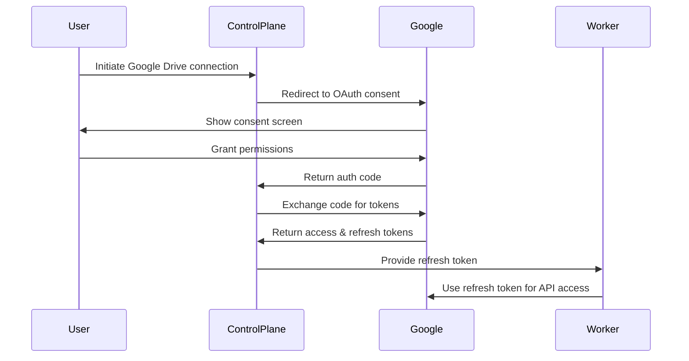

# Google Drive API Reference

## Overview

This document provides a comprehensive reference for the Google Drive API v3 as used by the Clustera Google Drive integration worker.

## Authentication

The Google Drive API uses OAuth 2.0 for authentication. Our integration uses the offline access type to obtain refresh tokens.

### OAuth 2.0 Flow



### Required Scopes

- `https://www.googleapis.com/auth/drive.readonly` - Read-only access to files
- `https://www.googleapis.com/auth/drive.metadata.readonly` - Read-only access to metadata

## Core API Endpoints

### Files Resource

#### List Files

```python
GET https://www.googleapis.com/drive/v3/files
```

**Parameters:**
- `pageSize` (int): Number of files to return (max: 1000, default: 100)
- `pageToken` (string): Token for next page of results
- `q` (string): Query string for filtering files
- `fields` (string): Fields to include in response
- `corpora` (string): Bodies of items to search (`user`, `domain`, `drive`, `allDrives`)
- `includeItemsFromAllDrives` (bool): Include shared drive items
- `supportsAllDrives` (bool): Support shared drives

**Query Examples:**
```python
# Modified after specific date
q = "modifiedTime > '2025-01-01T00:00:00'"

# Specific MIME type
q = "mimeType = 'application/pdf'"

# Not in trash
q = "trashed = false"

# Owned by user
q = "'user@example.com' in owners"

# Combined query
q = "modifiedTime > '2025-01-01T00:00:00' and trashed = false"
```

**Response:**
```json
{
  "kind": "drive#fileList",
  "nextPageToken": "~!!~AI9FV7Q...",
  "files": [
    {
      "id": "1aBcDeF...",
      "name": "Document.pdf",
      "mimeType": "application/pdf",
      "createdTime": "2025-01-01T10:00:00.000Z",
      "modifiedTime": "2025-01-15T14:30:00.000Z",
      "size": "102400",
      "webViewLink": "https://drive.google.com/file/d/1aBcDeF/view",
      "webContentLink": "https://drive.google.com/uc?id=1aBcDeF&export=download",
      "parents": ["folder_id"],
      "owners": [
        {
          "kind": "drive#user",
          "displayName": "John Doe",
          "emailAddress": "john@example.com"
        }
      ]
    }
  ]
}
```

#### Get File Metadata

```python
GET https://www.googleapis.com/drive/v3/files/{fileId}
```

**Parameters:**
- `fileId` (string): The ID of the file
- `fields` (string): Fields to include in response
- `supportsAllDrives` (bool): Support shared drives

**Field Selection:**
```python
# Comprehensive field selection
fields = "id,name,mimeType,size,createdTime,modifiedTime,parents,owners,permissions,webViewLink,webContentLink,md5Checksum,description,starred,trashed,properties,appProperties,capabilities,contentRestrictions,sharingUser,sharedWithMeTime"
```

### Changes Resource

#### List Changes

```python
GET https://www.googleapis.com/drive/v3/changes
```

**Parameters:**
- `pageToken` (string): Token for continuing previous list request
- `pageSize` (int): Maximum number of changes to return
- `restrictToMyDrive` (bool): Only show changes to files in My Drive
- `spaces` (string): Space-separated list of spaces to query (`drive`, `appDataFolder`)
- `fields` (string): Fields to include
- `includeItemsFromAllDrives` (bool): Include shared drive items
- `supportsAllDrives` (bool): Support shared drives

**Getting Start Page Token:**
```python
GET https://www.googleapis.com/drive/v3/changes/startPageToken
```

**Response:**
```json
{
  "kind": "drive#changeList",
  "nextPageToken": "1234",
  "newStartPageToken": "5678",
  "changes": [
    {
      "kind": "drive#change",
      "changeType": "file",
      "time": "2025-01-15T10:00:00.000Z",
      "removed": false,
      "fileId": "abc123",
      "file": {
        "id": "abc123",
        "name": "Updated Document.pdf",
        "modifiedTime": "2025-01-15T10:00:00.000Z"
      }
    }
  ]
}
```

### Permissions Resource

#### List Permissions

```python
GET https://www.googleapis.com/drive/v3/files/{fileId}/permissions
```

**Parameters:**
- `fileId` (string): The ID of the file
- `fields` (string): Fields to include
- `pageSize` (int): Maximum number of permissions to return
- `supportsAllDrives` (bool): Support shared drives

**Response:**
```json
{
  "kind": "drive#permissionList",
  "permissions": [
    {
      "id": "perm123",
      "type": "user",
      "emailAddress": "user@example.com",
      "role": "writer",
      "displayName": "Jane Doe"
    },
    {
      "id": "perm456",
      "type": "domain",
      "domain": "example.com",
      "role": "reader"
    }
  ]
}
```

### Revisions Resource

#### List Revisions

```python
GET https://www.googleapis.com/drive/v3/files/{fileId}/revisions
```

**Parameters:**
- `fileId` (string): The ID of the file
- `fields` (string): Fields to include
- `pageSize` (int): Maximum number of revisions to return

**Response:**
```json
{
  "kind": "drive#revisionList",
  "revisions": [
    {
      "id": "rev123",
      "mimeType": "application/pdf",
      "modifiedTime": "2025-01-14T10:00:00.000Z",
      "size": "98304",
      "lastModifyingUser": {
        "displayName": "John Doe",
        "emailAddress": "john@example.com"
      }
    }
  ]
}
```

## Rate Limiting

### Quotas

- **Per-user limit**: 1,000 requests per 100 seconds
- **Per-project limit**: 12,000 requests per 100 seconds
- **Daily quota**: 1 billion requests per day

### Best Practices

1. **Exponential Backoff**
```python
async def retry_with_backoff(func, max_retries=5):
    for retry in range(max_retries):
        try:
            return await func()
        except RateLimitError as e:
            if retry == max_retries - 1:
                raise
            wait_time = (2 ** retry) + random.uniform(0, 1)
            await asyncio.sleep(wait_time)
```

2. **Batch Requests**
```python
# Use batch endpoint for multiple operations
POST https://www.googleapis.com/batch/drive/v3
```

3. **Field Filtering**
```python
# Only request needed fields
fields = "files(id,name,modifiedTime)"
```

4. **Pagination**
```python
# Use reasonable page sizes
page_size = 100  # Balance between API calls and response size
```

## Error Codes

| Code | Description | Retry Strategy |
|------|-------------|----------------|
| 400 | Bad Request | Do not retry, fix request |
| 401 | Unauthorized | Refresh token and retry |
| 403 | Forbidden | Check permissions, may retry |
| 404 | Not Found | Do not retry |
| 429 | Too Many Requests | Exponential backoff |
| 500 | Internal Server Error | Exponential backoff |
| 503 | Service Unavailable | Exponential backoff |

## Common Error Responses

### Rate Limit Error
```json
{
  "error": {
    "errors": [
      {
        "domain": "usageLimits",
        "reason": "rateLimitExceeded",
        "message": "User Rate Limit Exceeded"
      }
    ],
    "code": 429,
    "message": "User Rate Limit Exceeded"
  }
}
```

### Invalid Token Error
```json
{
  "error": {
    "errors": [
      {
        "domain": "global",
        "reason": "authError",
        "message": "Invalid Credentials"
      }
    ],
    "code": 401,
    "message": "Invalid Credentials"
  }
}
```

## Optimization Tips

### 1. Use Partial Responses

Instead of:
```python
GET /drive/v3/files/fileId
```

Use:
```python
GET /drive/v3/files/fileId?fields=id,name,mimeType,modifiedTime
```

### 2. Use Push Notifications

Set up push notifications to avoid polling:
```python
POST https://www.googleapis.com/drive/v3/changes/watch
{
  "id": "channel_id",
  "type": "web_hook",
  "address": "https://webhook.example.com/notifications",
  "token": "verification_token"
}
```

### 3. Cache Metadata

- Cache file metadata with TTL
- Use ETags for conditional requests
- Store change tokens for incremental sync

### 4. Parallel Processing

```python
async def fetch_files_parallel(file_ids):
    tasks = [fetch_file(file_id) for file_id in file_ids]
    return await asyncio.gather(*tasks)
```

## MIME Types Reference

| Type | MIME Type | Description |
|------|-----------|-------------|
| Folder | `application/vnd.google-apps.folder` | Google Drive folder |
| Document | `application/vnd.google-apps.document` | Google Docs |
| Spreadsheet | `application/vnd.google-apps.spreadsheet` | Google Sheets |
| Presentation | `application/vnd.google-apps.presentation` | Google Slides |
| PDF | `application/pdf` | PDF document |
| Image | `image/jpeg`, `image/png` | Image files |
| Video | `video/mp4` | Video files |

## Export Formats

Google Workspace files can be exported to various formats:

| Google Type | Export Formats |
|-------------|----------------|
| Google Docs | `application/pdf`, `application/vnd.openxmlformats-officedocument.wordprocessingml.document`, `text/plain`, `text/html` |
| Google Sheets | `application/pdf`, `application/vnd.openxmlformats-officedocument.spreadsheetml.sheet`, `text/csv` |
| Google Slides | `application/pdf`, `application/vnd.openxmlformats-officedocument.presentationml.presentation` |

## Security Considerations

1. **Token Storage**: Never log or store access tokens in plain text
2. **Scope Limitation**: Request minimum necessary scopes
3. **Token Rotation**: Regularly refresh access tokens
4. **Audit Logging**: Log all API access for compliance
5. **Data Encryption**: Encrypt sensitive data at rest and in transit

## Useful Resources

- [Official API Documentation](https://developers.google.com/drive/api/v3/reference)
- [OAuth 2.0 Guide](https://developers.google.com/identity/protocols/oauth2)
- [API Explorer](https://developers.google.com/drive/api/v3/reference/files/list)
- [Best Practices](https://developers.google.com/drive/api/v3/performance)
- [Quotas and Limits](https://developers.google.com/drive/api/v3/limits)